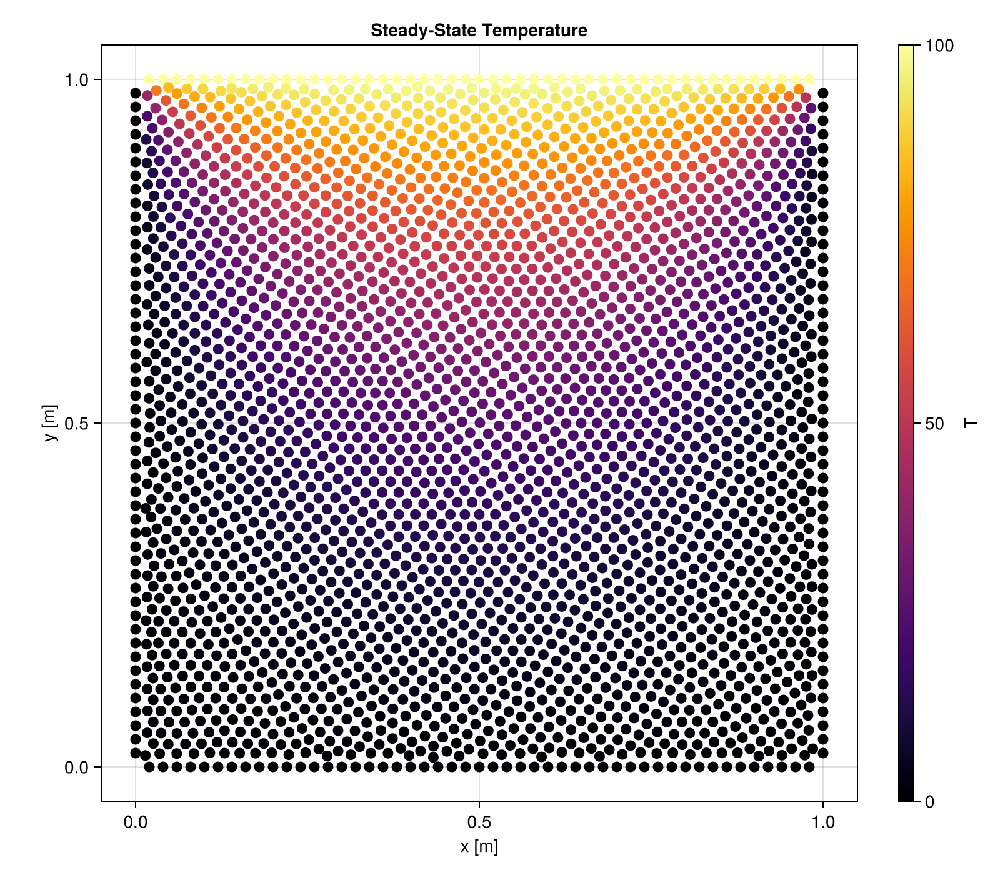
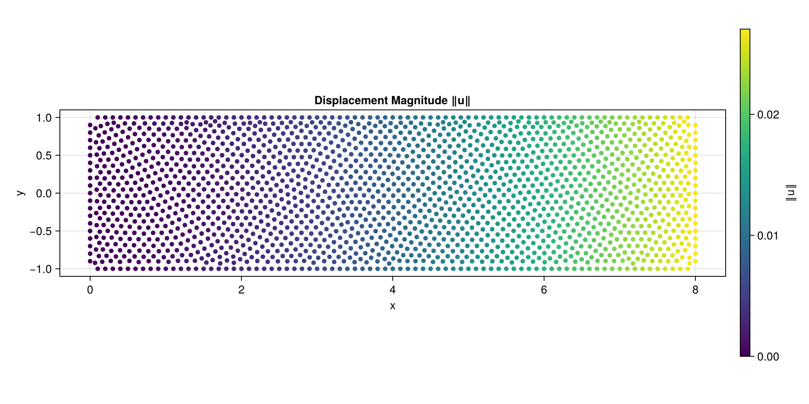

# Examples

## 2D Heat Conduction

Steady-state heat conduction on a 1m × 1m square with fixed temperatures on each edge.



### Steady-State

```julia
using WhatsThePoint
import WhatsThePoint as WTP
using Macchiato
using Unitful: m, °, ustrip
using CairoMakie

# Geometry
dx = 1/33 * m
part = PointBoundary(rectangle(1m, 1m)...)
split_surface!(part, 75°)
cloud = discretize(part, ConstantSpacing(dx), alg=VanDerSandeFornberg())
cloud, _ = repel(cloud, ConstantSpacing(dx); α=dx/20, max_iters=500)

# Boundary conditions & model
bcs = Dict(
    :surface1 => Temperature(0.0),    # bottom
    :surface2 => Temperature(0.0),    # right
    :surface3 => Temperature(100.0),  # top
    :surface4 => Temperature(0.0),    # left
)
domain = Domain(cloud, bcs, SolidEnergy(k=1.0, ρ=1.0, cₚ=1.0))

# Solve
sim = Simulation(domain)
run!(sim)
T = temperature(sim)

# Visualize
pts = points(cloud)
x = [ustrip(pt.x) for pt in pts]
y = [ustrip(pt.y) for pt in pts]

fig = Figure(; size=(800, 700))
ax = Axis(fig[1, 1]; title="Temperature", xlabel="x [m]", ylabel="y [m]", aspect=DataAspect())
sc = scatter!(ax, x, y; color=T, colormap=:inferno, markersize=8)
Colorbar(fig[1, 2], sc; label="T")
fig
```

### Transient

The same geometry and BCs can be run as a transient simulation by providing a time step and stop time:

```julia
sim = Simulation(domain; Δt=0.001, stop_time=1.0)
set!(sim, T=0.0)
run!(sim)

T_final = temperature(sim)
```

Callbacks and output writers let you monitor progress and save intermediate results:

```julia
sim.callbacks[:progress] = Callback(
    s -> println("t = $(s.time), iter = $(s.iteration)"),
    IterationInterval(100)
)
sim.output_writers[:vtk] = VTKOutputWriter("results/heat", schedule=TimeInterval(0.1))
run!(sim)
```

## 2D Cantilever Beam (Linear Elasticity)

A cantilever beam under end shear, validated against the Timoshenko analytical solution.



### Problem Setup

Geometry: L × 2D beam, x ∈ [0, L], y ∈ [-D, D]. The left end is clamped (prescribed displacement from the exact solution), the right end has a parabolic shear traction, and the top/bottom surfaces are traction-free.

Timoshenko beam solution (plane stress):

```
u(x,y) = -P/(6EI) [y((6L-3x)x + (2+ν)(y²-D²))]
v(x,y) =  P/(6EI) [3νy²(L-x) + (4+5ν)D²x + (3L-x)x²]
```

where I = 2D³/3 is the second moment of area.

### Full Example

```julia
using WhatsThePoint
import WhatsThePoint as WTP
using Macchiato
using RadialBasisFunctions: PHS
using Unitful: m, °, ustrip
using LinearAlgebra
using Statistics: mean
using CairoMakie

# Problem parameters
L = 8.0    # Beam length
D = 1.0    # Half-height
P = 1000.0 # Applied load
E_val = 1e7
ν_val = 0.3
I = 2D^3 / 3

# Analytical solution
u_exact(x, y) = -P / (6E_val * I) * y * ((6L - 3x) * x + (2 + ν_val) * (y^2 - D^2))
v_exact(x, y) = P / (6E_val * I) * (3ν_val * y^2 * (L - x) + (4 + 5ν_val) * D^2 * x + (3L - x) * x^2)

# Geometry
dx = 0.1 * m
rx = dx:dx:((L * m) - dx)
ry = dx:dx:((2D * m) - dx)

p_bot = [WTP.Point(i, -D * m) for i in rx]
n_bot = [WTP.Vec(0.0, -1.0) for _ in rx]
p_right = [WTP.Point(L * m, -D * m + i) for i in ry]
n_right = [WTP.Vec(1.0, 0.0) for _ in ry]
p_top = [WTP.Point(i, D * m) for i in reverse(rx)]
n_top = [WTP.Vec(0.0, 1.0) for _ in rx]
p_left = [WTP.Point(0.0m, -D * m + i) for i in reverse(ry)]
n_left = [WTP.Vec(-1.0, 0.0) for _ in ry]

pts = vcat(p_bot, p_right, p_top, p_left)
nrms = vcat(n_bot, n_right, n_top, n_left)
areas = fill(dx, length(pts))

part = PointBoundary(pts, nrms, areas)
split_surface!(part, 75°)

cloud = WTP.discretize(part, ConstantSpacing(dx), alg=VanDerSandeFornberg())
cloud, _ = repel(cloud, ConstantSpacing(dx); α=dx / 50, max_iters=5000)

# Boundary conditions
bc_left(x, t) = (u_exact(x[1], x[2]), v_exact(x[1], x[2]))
bc_right(x, t) = (0.0, P * (D^2 - x[2]^2) / (2I))

bcs = Dict(
    :surface1 => TractionFree(),          # bottom: free surface
    :surface2 => Traction(bc_right),       # right: parabolic shear
    :surface3 => TractionFree(),          # top: free surface
    :surface4 => Displacement(bc_left),   # left: clamped
)

# Model and solve
model = LinearElasticity(E=E_val, ν=ν_val)
domain = Domain(cloud, bcs, model)

sim = Simulation(domain)
run!(sim; basis=PHS(3; poly_deg=3))

# Extract results
ux_sim, uy_sim = displacement(sim)
N = length(cloud)

# Compare with analytical solution
pts = points(cloud)
ux_ana = [u_exact(ustrip(pt.x), ustrip(pt.y)) for pt in pts]
uy_ana = [v_exact(ustrip(pt.x), ustrip(pt.y)) for pt in pts]

println("Mean absolute error uₓ: ", mean(abs.(ux_sim .- ux_ana)))
println("Mean absolute error uᵧ: ", mean(abs.(uy_sim .- uy_ana)))

# Visualize displacement magnitude
x = [ustrip(pt.x) for pt in pts]
y = [ustrip(pt.y) for pt in pts]
displacement_mag = sqrt.(ux_sim .^ 2 .+ uy_sim .^ 2)

fig = Figure(; size=(1000, 500))
ax = Axis(fig[1, 1]; title="Displacement Magnitude ‖u‖", xlabel="x", ylabel="y", aspect=DataAspect())
sc = scatter!(ax, x, y; color=displacement_mag, colormap=:viridis, markersize=6)
Colorbar(fig[1, 2], sc; label="‖u‖")
fig
```
