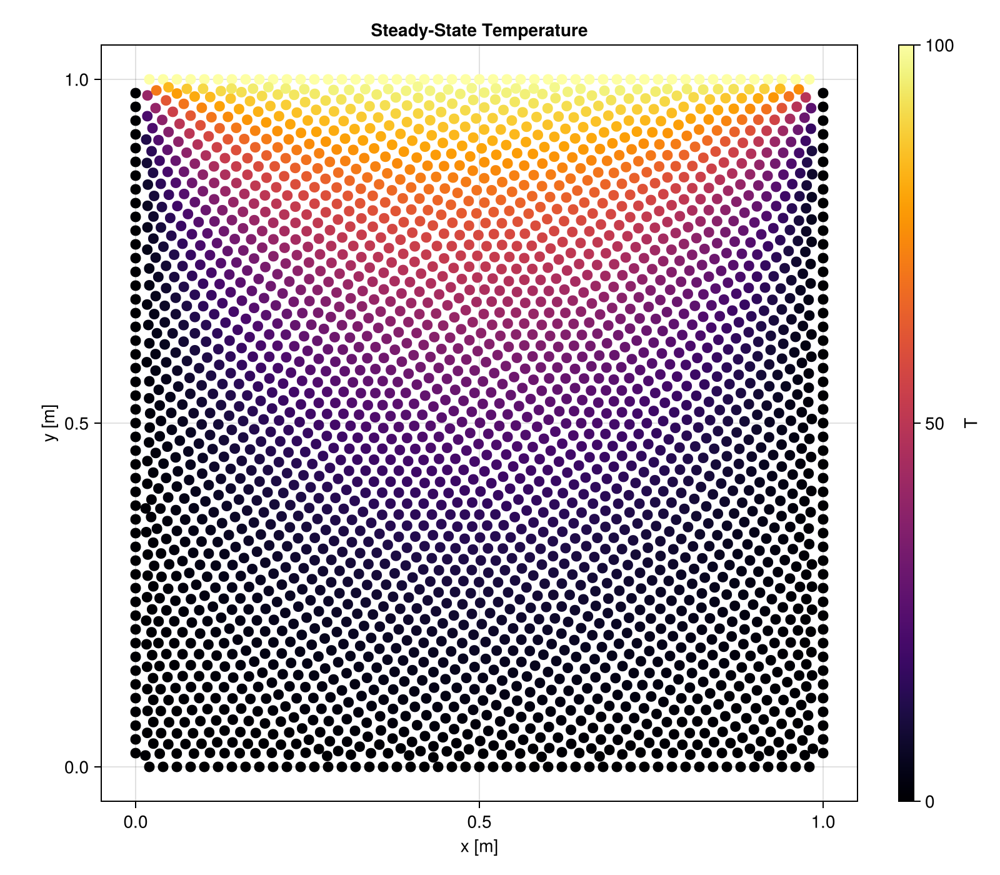
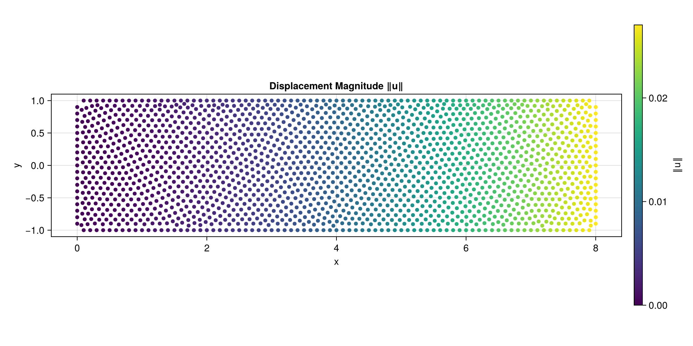

```@raw html
---
layout: home

hero:
  name: "Macchiato.jl"
  text: "PDEs on scattered point clouds"
  tagline: Define any equation with a small model interface — no mesh, no element quality, no remeshing.
  image:
    src: /hero.png
    alt: Cantilever beam point cloud coloured by displacement magnitude
  actions:
    - theme: brand
      text: Get Started
      link: /getting_started
    - theme: alt
      text: Custom PDEs
      link: /custom_pdes
    - theme: alt
      text: API Reference
      link: /api
    - theme: alt
      text: View on GitHub
      link: https://github.com/JuliaMeshless/Macchiato.jl

features:
  - icon: 🧩
    title: Any PDE, Not Just Ours
    details: Implement two methods — assemble a system, or return a time-derivative — and Macchiato handles operators, boundary conditions, and time integration for your equation.
    link: /custom_pdes
  - icon: 🔥
    title: Built-in Physics
    details: Heat transfer, linear elasticity, and incompressible flow ship ready to use, as convenience models built on the same public interface you would use yourself.
    link: /api
  - icon: 🧱
    title: Boundary Conditions That Read Like Physics
    details: Dirichlet, Neumann, and Robin conditions with named aliases — write Temperature, HeatFlux, or Convection instead of remembering which generic type maps to which.
    link: /design
  - icon: ⏱️
    title: Steady and Transient
    details: The same domain solves either way. Steady-state assembles one linear system; transient hands an ODE function to OrdinaryDiffEq, defaulting to an implicit solver because diffusion is stiff.
    link: /getting_started
  - icon: 🫧
    title: Meshless Geometry
    details: Drop points on the boundary, fill the interior, and refine by adding points where you need accuracy. No connectivity, no element quality, no remeshing.
    link: /design
  - icon: 📤
    title: Fields Out, VTK Out
    details: Pull named fields straight off a simulation with temperature or displacement, or export the whole point cloud to VTK for ParaView.
    link: /api
---
```

```@meta
CurrentModule = Macchiato
```

```@raw html
<div class="vp-doc quick-example" style="width:80%; margin:auto">
```

## Quick Example

Steady-state heat conduction on a unit square, from geometry to temperature field:

```@setup quickstart
import WhatsThePoint as WTP
using Unitful: m
function rectangle(Lx, Ly; n=100)
    dx, dy = Lx / n, Ly / n
    rx, ry = (dx:dx:Lx-dx), (dy:dy:Ly-dy)
    pts = vcat(
        [WTP.Point(x, zero(Ly)) for x in rx],
        [WTP.Point(Lx, y) for y in ry],
        [WTP.Point(x, Ly) for x in reverse(rx)],
        [WTP.Point(zero(Lx), y) for y in reverse(ry)]
    )
    nrms = vcat(
        fill(WTP.Vec(0.0, -1.0), length(rx)),
        fill(WTP.Vec(1.0, 0.0), length(ry)),
        fill(WTP.Vec(0.0, 1.0), length(rx)),
        fill(WTP.Vec(-1.0, 0.0), length(ry))
    )
    areas = fill(dx, length(pts))
    return pts, nrms, areas
end
```

```@example quickstart
using WhatsThePoint, Macchiato
using Unitful: m, °

# 1. Geometry: 1m × 1m rectangle point cloud
part = PointBoundary(rectangle(1m, 1m)...)
split_surface!(part, 75°)
cloud = discretize(part, ConstantSpacing(1/33 * m))

# 2. Boundary conditions
bcs = Dict(
    :surface1 => Temperature(0.0),    # bottom
    :surface2 => Temperature(0.0),    # right
    :surface3 => Temperature(100.0),  # top
    :surface4 => Temperature(0.0),    # left
)

# 3. Solve
domain = Domain(cloud, bcs, SolidEnergy(k=1.0, ρ=1.0, cₚ=1.0))
sim = Simulation(domain)
run!(sim)

# 4. Extract results
T = temperature(sim)
extrema(T)   # (coldest, hottest)
```

That is the whole workflow. [Getting Started](@ref) walks through each step in detail, and
[Custom PDEs](@ref) shows how to swap `SolidEnergy` for an equation of your own.

## Installation

```julia
using Pkg
Pkg.add(url="https://github.com/JuliaMeshless/Macchiato.jl")
```

## Gallery

```@raw html
<div class="gallery-grid">
```

 

```@raw html
</div>
```

Steady-state temperature on a unit square, and displacement magnitude in a cantilever beam under
end shear. See the [Examples](@ref) page for the code behind both.

## Why Meshless Methods?

**Meshless methods** operate on scattered point clouds with no connectivity requirements:

- **Simple geometry handling** — drop points on the boundary and fill the interior; no element quality concerns
- **Easy refinement** — add more points where you need accuracy; no remeshing required
- **Natural for moving boundaries** — points move freely without topological constraints

Macchiato.jl uses **radial basis function (RBF)** collocation, where differential operators are approximated at each point using its local neighborhood of nearest neighbors.

## The JuliaMeshless Ecosystem

Macchiato.jl is the physics layer of [JuliaMeshless](https://github.com/JuliaMeshless) — three
composable packages that form a complete simulation pipeline.

```@raw html
<div class="ecosystem-flow">
  <a class="ecosystem-card" href="https://github.com/JuliaMeshless/WhatsThePoint.jl">
    <div class="ecosystem-stage">Geometry</div>
    <h3>WhatsThePoint.jl</h3>
    <p>Boundary creation, surface splitting, interior fill, and point repulsion.</p>
  </a>
  <div class="ecosystem-arrow" aria-hidden="true">→</div>
  <a class="ecosystem-card" href="https://github.com/JuliaMeshless/RadialBasisFunctions.jl">
    <div class="ecosystem-stage">Numerics</div>
    <h3>RadialBasisFunctions.jl</h3>
    <p>RBF interpolation and differential operators (∇², ∂/∂x, custom) with KNN stencil selection.</p>
  </a>
  <div class="ecosystem-arrow" aria-hidden="true">→</div>
  <a class="ecosystem-card ecosystem-card-active" href="https://github.com/JuliaMeshless/Macchiato.jl">
    <div class="ecosystem-stage">PDE Framework</div>
    <h3>Macchiato.jl</h3>
    <p>Model interface, boundary conditions, simulation and time stepping, field extraction and VTK I/O.</p>
  </a>
</div>
```

## Built-in Models

Macchiato ships with ready-to-use models for common physics. You can also [define your own](@ref "Custom PDEs") for any PDE.

| Physics | Model | Status |
|---------|-------|--------|
| Heat transfer | [`SolidEnergy`](@ref) | Steady-state and transient |
| Linear elasticity | [`LinearElasticity`](@ref) | Steady-state (2D plane stress) |
| Incompressible fluids | [`IncompressibleNavierStokes`](@ref) | In development |

## Next Steps

- [Getting Started](@ref) — step-by-step tutorial from geometry to results
- [Custom PDEs](@ref) — define and solve your own equations
- [Examples](@ref) — complete worked examples with visualization
- [Package Design](@ref) — architecture and extension guide
- [API Reference](@ref) — full type and function documentation

```@raw html
</div>
```
